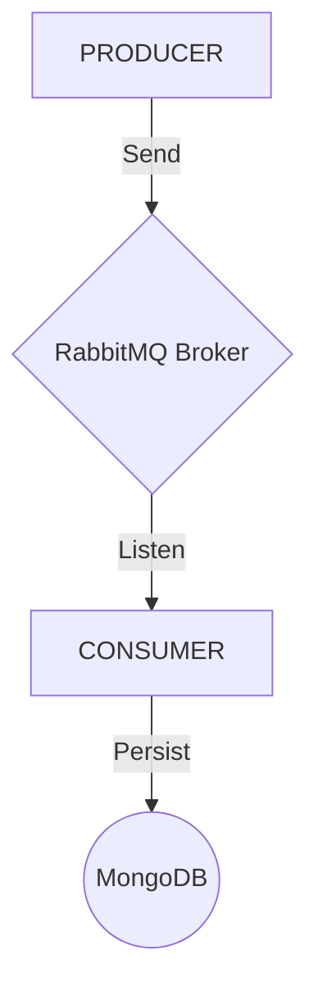

# spring-rabbitmq-example

Basic example of spring rabbitmq producer and consumer implementation.

### Consumer
> Previously running RabbitMQ and MongoDB on localhost.  
```sh
cd rabbitmqxp-consumer/
mvn clean && mvn package
java -jar target/rabbitmqxp-0.0.1-SNAPSHOT.jar
```
> That will will listener rabbitmq and persist on mongodb.  
  
---
  
### Producer
```sh
cd rabbitmqxp-producer/
mvn clean && mvn package
java -jar target/rabbitmqxp-0.0.1-SNAPSHOT.jar
```
> Open a http server on port 8080.  

Sending message to producer:
```sh
curl --header "Content-Type: application/json" -X POST -d '{"key":"FOO" "value":"BAR"}' http://localhost:8080/message
```

